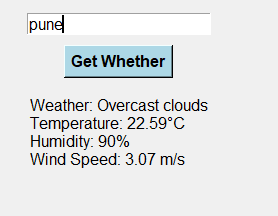
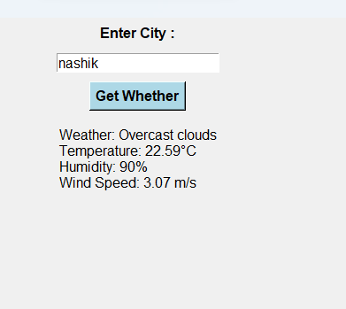

# 🌦️ Weather App GUI

A simple graphical user interface (GUI) based Weather Application that shows real-time weather information for any city.  
This project is built using **Python** and **Tkinter**, and fetches live weather data using the **OpenWeatherMap API**.

---

## 🚀 Features
- 🌍 Search weather by city name  
- 🌡️ Displays temperature, humidity, and weather conditions  
- ⏱️ Shows real-time updated weather information  
- 🎨 User-friendly Tkinter GUI  

---

## 🛠️ Tech Stack
- **Python 3**  
- **Tkinter** (GUI library)  
- **Requests** (to fetch weather data)  
- **OpenWeatherMap API**  

---

## 📂 Project Structure

weather-app-gui/
│-- main.py
│-- README.md
│-- requirements.txt


---

## ⚡ Installation & Setup
1. Clone this repository  
   ```bash
   git clone https://github.com/dataCrafter2025/weather-app-gui.git
   cd weather-app-gui


Install dependencies

pip install -r requirements.txt


Run the app

python main.py


📸 Screenshots

### 📸 Screenshots  

  
  


🔑 API Key Setup

Create a free account at OpenWeatherMap

Generate your API key

Add it in your main.py file like this:

API_KEY = "72fafaf204e223c8b180561c517cdc23"


